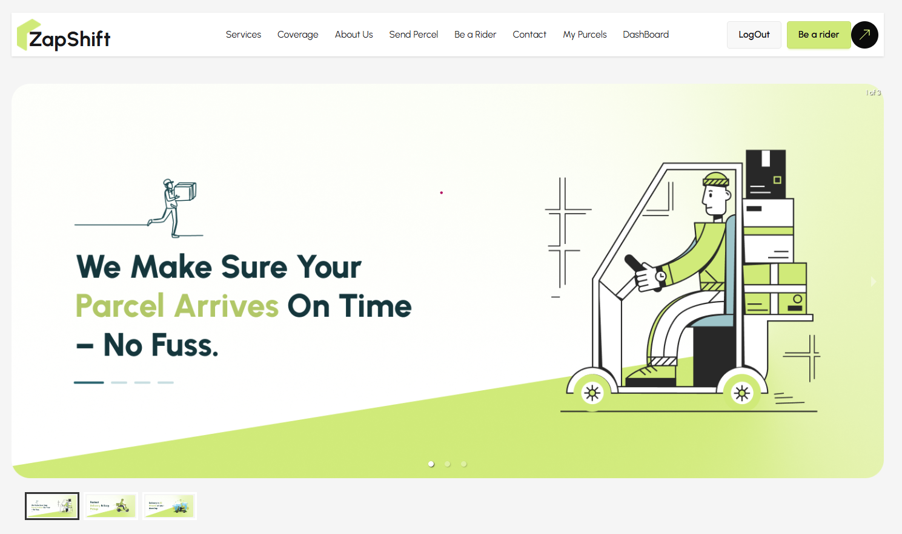
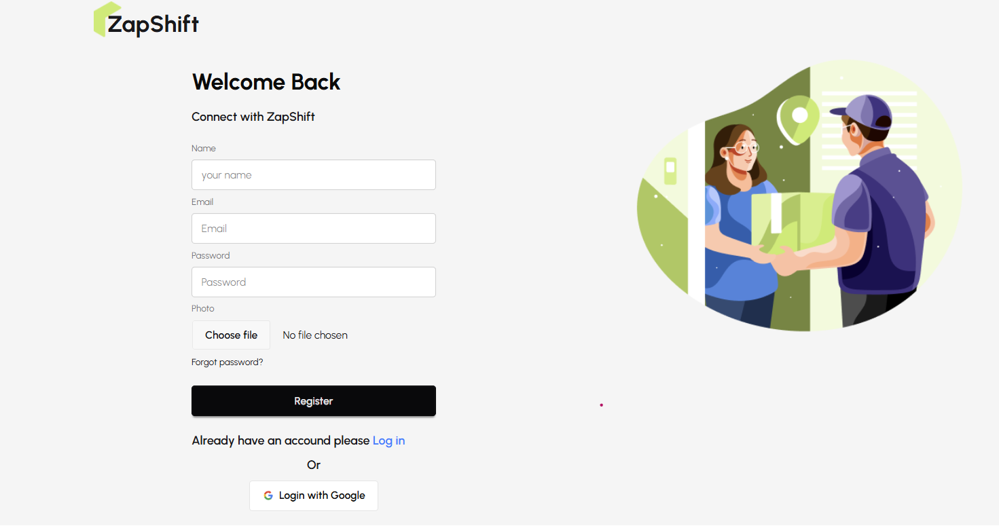
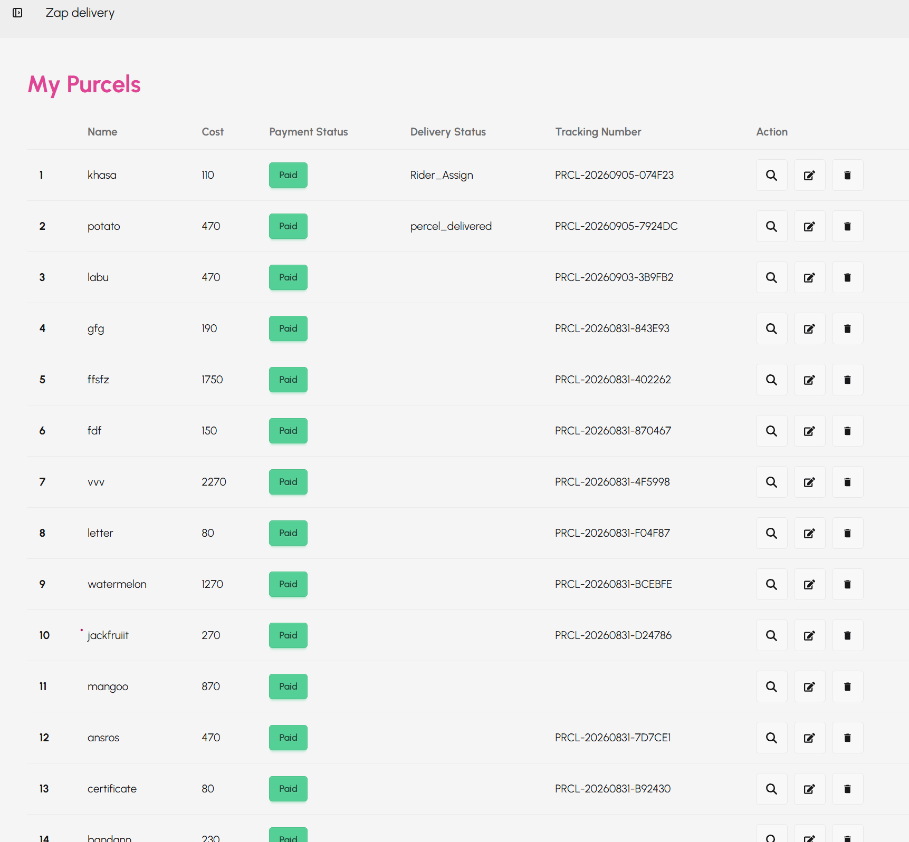
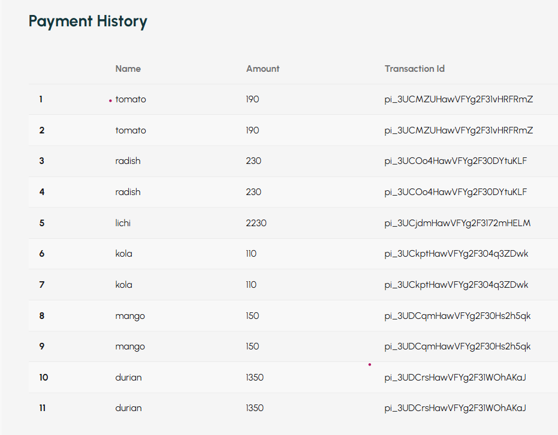
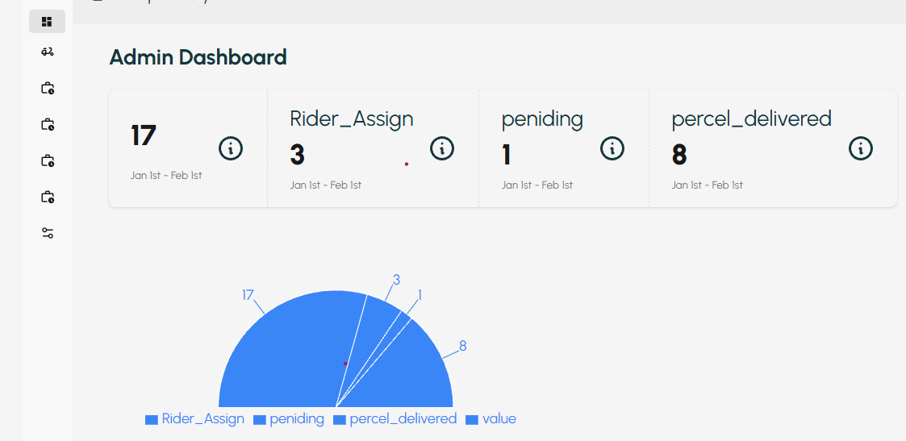
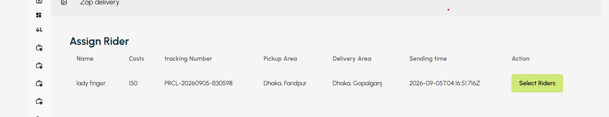
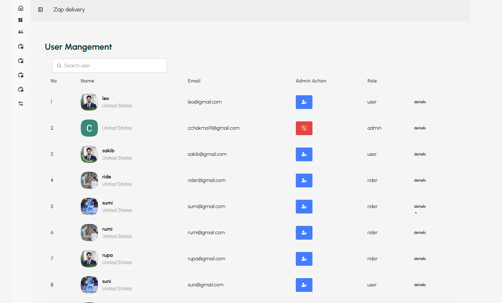
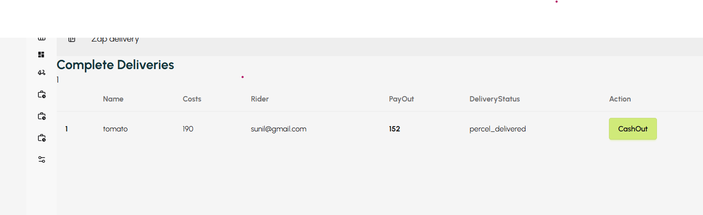

# 🚚 Zaper - Parcel Delivery Management System

Zaper is a comprehensive parcel delivery management web application built with **React**, **Vite**, and **Firebase**. It provides an intuitive platform for users to send parcels, track deliveries, manage payments, and for admins/riders to manage the delivery ecosystem.

## 📸 Project Screenshots

### Homepage & Landing Page



### Authentication



### User Dashboard




### Admin Dashboard




### Rider Dashboard



---

## ✨ Features

### 👤 User Features
- ✅ User Authentication (Email/Password & Google Login)
- ✅ Send Parcels with multiple destination options
- ✅ Track Parcel Status in Real-time
- ✅ Payment Processing & History
- ✅ Dashboard with order management
- ✅ Coverage Area Information

### 🛡️ Admin Features
- ✅ Approve/Reject Rider Applications
- ✅ User Management & Role Assignment
- ✅ Assign Riders to Deliveries
- ✅ View All Parcels & Delivery Status
- ✅ Analytics & Reports

### 🏍️ Rider Features
- ✅ Apply to become a Rider
- ✅ Accept/Manage Delivery Assignments
- ✅ Track Assigned Deliveries
- ✅ Complete Deliveries
- ✅ View Earnings & History

---

## 🛠️ Tech Stack

### Frontend
- **React 19** - UI Library
- **Vite** - Build Tool & Dev Server
- **TailwindCSS** - Styling
- **Material-UI** - Component Library
- **React Router v8** - Client-side Routing
- **React Hook Form** - Form Management
- **Axios** - HTTP Client
- **TanStack React Query** - Server State Management
- **Sweetalert2** - Notifications
- **React Icons** - Icon Library

### Backend & Services
- **Firebase Authentication** - User Auth & Session Management
- **Zaper Server** - Custom Backend API
- **MongoDB** - Database (via backend)

### Deployment
- **Vercel** - Backend Hosting
- **Vite** - Frontend Build

---

## 📁 Project Structure

```
src/
├── AuthProvider/          # Firebase Authentication Context
│   ├── AuthContext.jsx
│   └── AuthProvider.jsx
├── Components/            # Reusable Components
│   ├── Home/              # Homepage sections
│   ├── Loader/            # Loading spinner
│   └── Mytabs/            # Custom tabs
├── Firebase/              # Firebase Configuration
│   └── Firebase.config.js
├── Hooks/                 # Custom React Hooks
│   ├── UseAuth.jsx        # Auth context hook
│   ├── UseAxiosSecure.jsx # Secure API calls
│   └── UseRole.jsx        # Role-based access
├── Layouts/               # Main layouts
│   ├── RootLayout.jsx
│   ├── AuthLayout.jsx
│   └── DashboardLayout.jsx
├── Pages/                 # Page components
│   ├── Auth/              # Login & Registration
│   ├── Dashboard/         # Admin, User, Rider dashboards
│   ├── Home/              # Homepage
│   ├── SendPercel/        # Parcel creation
│   └── PercelTracking/    # Track parcel
├── Routes/                # Routing & Route Guards
│   ├── Router.jsx         # Route configuration
│   ├── PrivateRoute.jsx   # Protected routes
│   ├── AdminRoute.jsx     # Admin-only routes
│   └── RiderRoute.jsx     # Rider-only routes
├── App.jsx
├── main.jsx
└── index.css
```

---

## 🚀 Getting Started

### Prerequisites
- Node.js (v16+)
- npm or yarn
- Firebase Account
- Backend API (Zaper Server)

### Installation

1. **Clone the repository**
```bash
git clone <repository-url>
cd zaper-client
```

2. **Install dependencies**
```bash
npm install
```

3. **Configure Environment Variables**
Create a `.env.local` file in the root directory:
```env
VITE_FIREBASE_API_KEY=your_firebase_api_key
VITE_FIREBASE_AUTH_DOMAIN=your_firebase_auth_domain
VITE_FIREBASE_PROJECT_ID=your_firebase_project_id
VITE_FIREBASE_STORAGE_BUCKET=your_firebase_storage_bucket
VITE_FIREBASE_MESSAGING_SENDER_ID=your_firebase_messaging_sender_id
VITE_FIREBASE_APP_ID=your_firebase_app_id
VITE_API_BASE_URL=https://zaper-server.vercel.app
```

4. **Start Development Server**
```bash
npm run dev
```
Server runs at: `http://localhost:5173`

### Build for Production
```bash
npm run build
```

### Preview Production Build
```bash
npm run preview
```

### Linting
```bash
npm run lint
```

---

## 🔐 Authentication Flow

1. User registers/logs in via Firebase
2. Frontend requests authentication token from backend (`/getToken`)
3. Backend sets httpOnly cookie with token
4. All subsequent API requests include the cookie via axios interceptor
5. Protected routes validate authentication before rendering

---

## 🗄️ API Integration

The app communicates with the backend via:
- **Base URL**: `https://zaper-server.vercel.app`
- **Authentication**: httpOnly cookies + axios interceptors
- **Error Handling**: Automatic redirect to login on 401/403 errors

### Key Endpoints
- `POST /getToken` - Get authentication token
- `GET /payments?email=user@email.com` - User payment history
- `POST /parcels` - Create new parcel
- `GET /riders` - List all riders (admin)
- `PUT /assignments/:id` - Update delivery assignment

---

## 🎯 Role-Based Access Control

- **User**: Can send parcels, track deliveries, view payment history
- **Admin**: Can approve riders, manage users, assign deliveries, view analytics
- **Rider**: Can accept deliveries, track assignments, complete orders

---

## 🐛 Troubleshooting

### Issue: Getting redirected to login on Payment History

**Solution**: This typically indicates an authentication token/cookie issue. Check:
1. Browser Network tab → `/getToken` request returns 200 with Set-Cookie header
2. Browser Network tab → `/payments` request includes Cookie header
3. Backend is properly validating the cookie

### Issue: CORS errors

**Solution**: Backend CORS must allow:
- Credentials: `credentials: 'include'`
- Proper origin headers

---

## 📝 Environment Variables Guide

| Variable | Description |
|----------|-------------|
| `VITE_FIREBASE_API_KEY` | Firebase API Key |
| `VITE_FIREBASE_AUTH_DOMAIN` | Firebase Auth Domain |
| `VITE_FIREBASE_PROJECT_ID` | Firebase Project ID |
| `VITE_API_BASE_URL` | Backend API Base URL |

---

## 🤝 Contributing

1. Create a feature branch (`git checkout -b feature/AmazingFeature`)
2. Commit your changes (`git commit -m 'Add some AmazingFeature'`)
3. Push to the branch (`git push origin feature/AmazingFeature`)
4. Open a Pull Request

---

## 📄 License

This project is private and proprietary.

---

## 👨‍💻 Support

For issues and questions, please contact the development team.

---

**Built with ❤️ using React & Vite**
